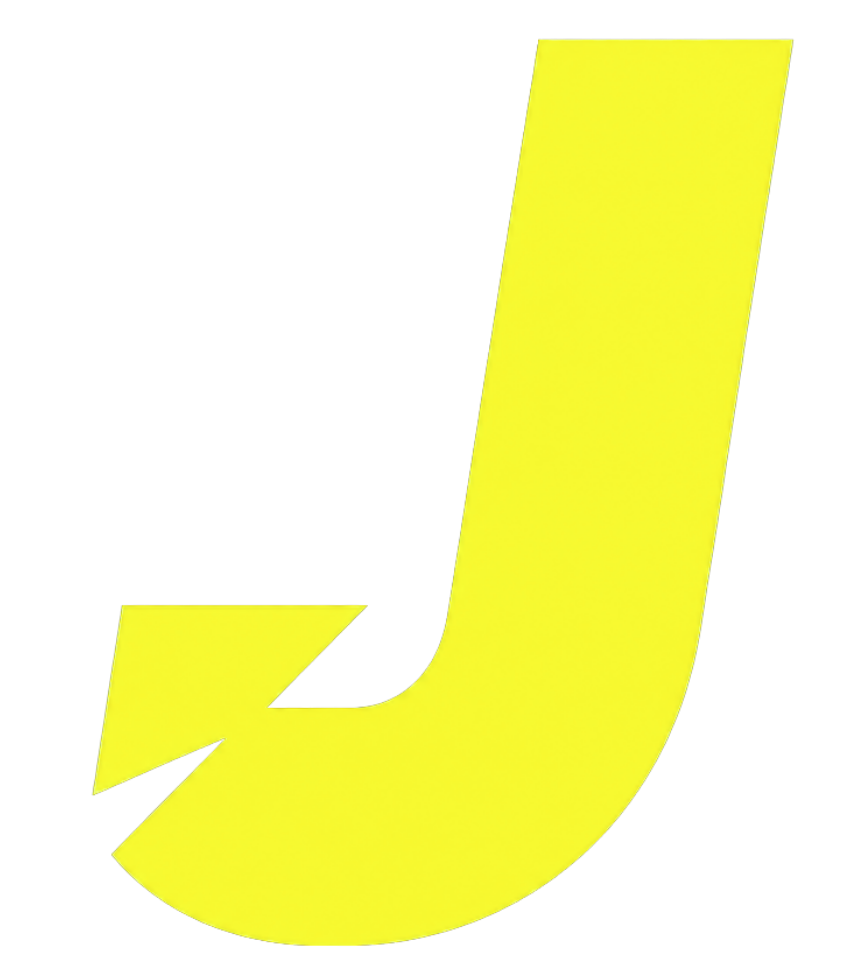

  <!-- Ensure the src path points correctly to your logo, e.g., if hosted on GitHub -->
  
  
  <h1>JERVYS PORTFOLIO</h1>
  
  

    <strong>Building ideas worth seeing. Designs worth feeling. Experiences worth remembering.</strong>
  

  

    
    
    
  

 

## ⚡ Overview

A highly interactive, design-focused personal portfolio web application built with React, Vite, and Tailwind CSS. This project showcases a unique aesthetic with custom micro-animations, interactive typography, and a premium user experience. 

Designed with a sleek **yellow and black** theme, reflecting a modern, bold, and creative identity.

## ✨ Key Features

| Feature | Description |
| :--- | :--- |
| 🟡 **Interactive Custom Cursor** | A smooth, custom-built cursor that reacts to clickable elements and enhances immersion. |
| 🟡 **Dynamic Typography** | Custom text reveal animations, staggered letter transitions, and interactive words. |
| 🟡 **Glassmorphism Design** | Sleek UI cards with backdrop blurs and semi-transparent borders for a premium feel. |
| 🟡 **Desktop-Optimized** | Designed primarily for wider viewports with a dedicated notice for unsupported resolutions. |

## 📁 Project Structure

- `src/App.jsx` — The main entry point containing the portfolio layout, interactive elements, and animations.
- `src/index.css` — Global styles and Tailwind directives.
- `public/` — Static assets such as images and icons.

 

  
<i>Designed with purpose. Built by Jervys.</i>

